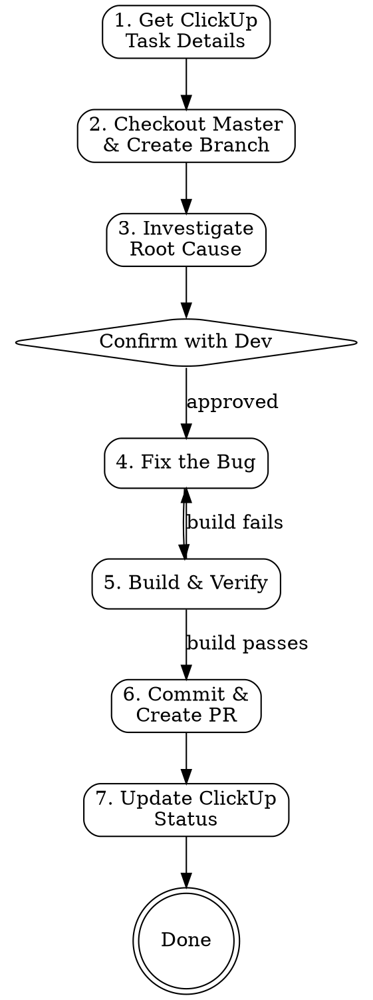

# ClickUp Task to Pull Request

## Overview

Complete bug fix lifecycle: ClickUp task analysis → codebase investigation → root cause analysis → code fix → branch & PR → task status update. Takes an existing ClickUp bug task and delivers a ready-to-review PR.

## Prerequisites

**Required MCP servers:**
- **ClickUp** — for task details and status management

**Required CLI tools:**
- `gh` (GitHub CLI) — authenticated for PR creation
- `git` — with remotes configured

**Required skills:**
- `superpowers:systematic-debugging` — for root cause investigation

## Workflow



## Steps

### 1. Get ClickUp Task Details

```
Input: ClickUp task ID (e.g. 86ewqfe4q) or URL (e.g. https://app.clickup.com/t/6958790/CMS-2714)
```

- Extract task ID from URL if provided (the alphanumeric part after `/t/`)
- Get task details: `mcp__clickup__get_task_details` with `task_id` and `include_subtasks: true`
- Extract and summarize:
  - **Title** and **description** — understand what the bug is
  - **Custom ID** (e.g. CMS-2714) — used for branch naming and PR title
  - **Priority** and **assignees**
  - **Attachments** — screenshots or recordings that show the bug
  - **Labels** — identify if it's FE, BE, or both

### 2. Checkout Master & Create Branch

```bash
git checkout master && git pull
git checkout -b bugfix/<CustomID>-<short-kebab-description>
```

**Branch naming:** `bugfix/<CustomID>-<short-kebab-description>`
- Example: `bugfix/CMS-2714-hide-disabled-profiles-from-racf-resident-list`

### 3. Investigate Root Cause

**Invoke `superpowers:systematic-debugging` skill** and follow its four phases:

**Phase 1 — Root Cause Investigation:**
- Parse the task description for keywords: feature area, page/screen, entity names, error messages
- Use `Agent` with `subagent_type: Explore` to search the codebase thoroughly:
  - Find relevant controllers, services, and components
  - Trace the data flow from API endpoint → service → repository → database
  - Identify the query/logic that produces incorrect results
- Check for common CMS patterns that cause bugs:
  - `IgnoreQueryFilters()` removing soft-delete filters on navigation properties
  - Missing `DeletedAt == null` checks when using `AllIncludingArchived`
  - Incorrect LINQ expressions on `EmployeeLocation` → `Employee` navigation
  - Frontend calling wrong API endpoint

**Phase 2 — Pattern Analysis:**
- Find similar working code in the codebase (how do other queries handle the same pattern?)
- Compare working vs broken queries

**Phase 3 — Hypothesis:**
- Form a clear hypothesis: "X is the root cause because Y"
- Identify the minimal fix

**Pause — Confirm with developer before proceeding.**

Present the root cause analysis and proposed fix. Use `AskUserQuestion` if needed.

### 4. Fix the Bug

- Make the **minimal, targeted fix** — don't refactor surrounding code
- Fix only what the task describes — no "while I'm here" improvements
- Read the file after editing to confirm correctness

### 5. Build & Verify

**This step is mandatory — no skipping.**

```bash
# Backend fix
cd src && dotnet build CMS.WebApi/CMS.WebApi.csproj --no-restore

# Frontend fix
cd src/CMS.WebApi/ClientApp && yarn build:prod
```

- Build MUST pass with 0 errors before proceeding
- If build fails, go back to step 4 and fix
- Run `git diff` to review the change — confirm it's minimal and correct

### 6. Commit & Create PR

**Commit message format:**
```
[b] [<CustomID>] <Short description of the fix>

<Root cause explanation in 1-2 sentences>

Co-Authored-By: Claude Opus 4.6 <noreply@anthropic.com>
```

**PR title format:** `[b] [<CustomID>] <Short description>`

**PR body format:**
```markdown
## Summary
- <What was fixed and why>
- **Root cause**: <detailed explanation>
- **Fix**: <what was changed>

## Test plan
- [ ] <Steps to verify the fix>
- [ ] <Edge cases to check>

**ClickUp Task:** <clickup-url>

Generated with [Claude Code](https://claude.com/claude-code)
```

**Steps:**
1. Stage changed files by name (not `git add -A`)
2. Commit with HEREDOC format for multi-line message
3. Push to remote — try `upstream` if `origin` is a fork
4. Create PR with `gh pr create` targeting `master`
5. If fork causes issues, push to `upstream` remote and use `--repo` flag

### 7. Update ClickUp Task Status

After the PR is created successfully:

1. Get available statuses: `mcp__clickup__get_space` with the space ID from task details
2. Find the correct status name (case-sensitive, e.g. `pr - in review`)
3. Update status: `mcp__clickup__update_task` with `task_id` and `status`

**Common status names in CMS space:**
| Status | Value |
|--------|-------|
| Open | `Open` |
| In Progress | `in progress` |
| PR In Review | `pr - in review` |
| Finished | `finished` |
| Staging | `staging` |
| Production | `production` |

## Common Mistakes

| Mistake | Fix |
|---------|-----|
| Fixing symptoms, not root cause | Always trace the full data flow before coding |
| Missing `DeletedAt` filter on navigation properties | When `IgnoreQueryFilters()` is used, ALL entity filters are removed — add explicit checks |
| ClickUp status case mismatch | Always fetch space statuses first — they're lowercase (e.g. `pr - in review` not `PR In Review`) |
| PR fails on fork repos | Push to `upstream` remote, use `gh pr create --repo owner/repo` |
| Forgetting to build before PR | Always run `dotnet build` or `yarn build:prod` — no exceptions |
| Overly broad fix | Fix only what the ClickUp task describes |
| Using `git add -A` | Stage specific files to avoid committing secrets or unrelated changes |

## Quick Reference

| Item | Format |
|------|--------|
| Branch | `bugfix/<CustomID>-<kebab-description>` |
| Commit prefix | `[b] [<CustomID>]` |
| PR title | `[b] [<CustomID>] <Description>` |
| PR target | `master` |
| ClickUp status after PR | `pr - in review` |

## Checklist

- [ ] ClickUp task analyzed — title, description, priority, attachments reviewed
- [ ] Checked out from latest `master`
- [ ] Root cause identified using systematic debugging
- [ ] **Developer confirmed** root cause before coding
- [ ] Fix is minimal and targeted
- [ ] Build passes with 0 errors
- [ ] `git diff` reviewed — change is correct and minimal
- [ ] Branch follows `bugfix/<CustomID>-<desc>` convention
- [ ] Commit message includes `[b] [<CustomID>]` prefix and Co-Authored-By
- [ ] PR title follows `[b] [<CustomID>] Description` format
- [ ] PR includes summary, root cause, test plan, and ClickUp link
- [ ] ClickUp task status updated to `pr - in review`
