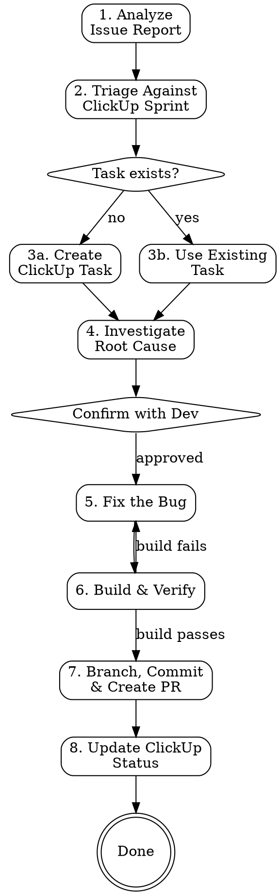

# Issue Report to Pull Request

## Overview

Complete lifecycle from external issue report to deliverable PR: analyze report → triage against ClickUp sprint → create task if missing → investigate root cause → fix → branch & PR → update task status. Bridges the gap between informal bug reports and tracked, code-reviewed fixes.

## Prerequisites

**Required MCP servers:**
- **ClickUp** — for sprint task lookup, creation, and status management

**Required CLI tools:**
- `gh` (GitHub CLI) — authenticated for PR creation
- `git` — with remotes configured

**Required skills:**
- `superpowers:systematic-debugging` — for root cause investigation

## Workflow



## Steps

### 1. Analyze Issue Report

```
Input: Issue description from email, Slack, verbal report, or any external source
```

- **Extract key information** from the report:
  - **Who reported it** — name, role (e.g. "Aaron requested...")
  - **What feature/module** — identify the area (e.g. "onsite", "billing", "consent")
  - **What's wrong** — current behavior vs expected behavior
  - **When it happens** — conditions, timing, triggers
  - **Severity** — blocking users? data loss? cosmetic?
- **Summarize the issue** in one sentence for later use in task title and PR description
- If the report is unclear, use `AskUserQuestion` to clarify before proceeding

### 2. Triage Against ClickUp Sprint

**Input required from user:** Sprint list URL or list ID.

Extract the list ID from the URL. For example:
- `https://spiderbox.clickup.com/6958790/v/l/6-901816565652-1?pr=7809207` → list ID: `901816565652`

**Search for existing tasks:**
1. `mcp__clickup__get_tasks` with `list_id` from the sprint
2. Search task names and descriptions for keywords from the issue report
3. Look for matching feature area, error description, or reporter mentions

**Present findings to user:**
- List any matching or related tasks with their status, assignee, and URL
- Clearly state whether a match was found or not

### 3a. Create ClickUp Task (if no existing task)

Use `mcp__clickup__create_task` with:
- **list_id**: the sprint list ID from step 2
- **name**: `[Feature Area] <Bug description>` (e.g. `[Medical Staff] Hide Onsite Details After 1 Week`)
- **description**: Include:
  - Who reported and context
  - Current behavior
  - Expected behavior
  - Any relevant screenshots or links
- **priority**: `2` (high) unless user specifies otherwise
- **assignees**: ask user or use current user's ID

Save the **task ID**, **custom ID** (e.g. CMS-2747), and **task URL** for later steps.

### 3b. Use Existing Task (if match found)

- Confirm with user that the found task is correct
- Extract **task ID**, **custom ID**, and **task URL**
- Update task status to `in progress` via `mcp__clickup__update_task`

### 4. Investigate Root Cause

**Invoke `superpowers:systematic-debugging` skill** and follow its four phases:

**Phase 1 — Root Cause Investigation:**
- Parse the issue description for keywords: feature area, page/screen, entity names, error messages
- Use `Agent` with `subagent_type: Explore` to search the codebase thoroughly:
  - Find relevant controllers, services, and components
  - Trace the data flow from API endpoint → service → repository → database
  - Search both backend (.cs) and frontend (.ts, .html) files
- Check for common CMS patterns that cause bugs:
  - Missing query filters (soft delete, archive, date-based)
  - Frontend showing data that backend should restrict
  - Inconsistent validation between frontend and backend

**Phase 2 — Pattern Analysis:**
- Find similar working code in the codebase
- Compare working vs broken logic

**Phase 3 — Hypothesis:**
- Form a clear hypothesis: "X is the root cause because Y"
- Identify the minimal fix needed

**Pause — Present root cause analysis and proposed fix to the developer for confirmation.**

### 5. Fix the Bug

- Make the **minimal, targeted fix** — don't refactor surrounding code
- Fix only what the task describes — no "while I'm here" improvements
- Read the file after editing to confirm correctness

### 6. Build & Verify

**This step is mandatory — no skipping.**

```bash
# Backend fix
cd src && dotnet build CMS.WebApi/CMS.WebApi.csproj --no-restore

# Frontend fix
cd src/CMS.WebApi/ClientApp && npm run build:prod
```

- Build MUST pass with 0 errors before proceeding
- If build fails, go back to step 5 and fix
- Run `git diff` to review the change — confirm it's minimal and correct

### 7. Branch, Commit & Create PR

**Branch naming:** `bugfix/<CustomID>-<short-kebab-description>`

**Steps:**
1. `git checkout master && git pull`
2. `git checkout -b bugfix/<CustomID>-<description>`
3. Stage changed files by name (not `git add -A`)
4. Commit with HEREDOC format:

```
[b] [<CustomID>] <Short description of the fix>

<Root cause explanation in 1-2 sentences>

Co-Authored-By: Claude Opus 4.6 <noreply@anthropic.com>
```

5. Push to remote with `-u` flag
6. Create PR with `gh pr create`:

**PR title:** `[b] [<CustomID>] <Short description>`

**PR body:**
```markdown
## Summary
- <What was fixed and why>
- <Root cause explanation>
- <What was changed>

## ClickUp
<clickup-task-url>

## Test plan
- [ ] <Steps to verify the fix>
- [ ] <Edge cases to check>

Generated with [Claude Code](https://claude.com/claude-code)
```

7. If fork causes issues, push to `upstream` remote and use `--repo` flag

### 8. Update ClickUp Task Status

After PR is created:
- Update status to `pr - in review` via `mcp__clickup__update_task`

**Common status names in CMS space:**

| Status | Value |
|--------|-------|
| Open | `Open` |
| In Progress | `in progress` |
| PR In Review | `pr - in review` |
| Finished | `finished` |
| Staging | `staging` |
| Production | `production` |

## Common Mistakes

| Mistake | Fix |
|---------|-----|
| Skipping sprint triage | Always check for existing tasks first — avoid duplicates |
| Assuming sprint/list ID | Always ask user for the sprint link or ID |
| Creating duplicate tasks | Search task names AND descriptions before creating |
| Fixing symptoms, not root cause | Always trace the full data flow before coding |
| Skipping dev confirmation | Always pause after root cause analysis |
| Not updating ClickUp status | Update to `in progress` when starting, `pr - in review` after PR |
| Using `git add -A` | Stage specific files to avoid committing secrets or unrelated changes |
| Building from wrong directory | Backend: `src/`, Frontend: `src/CMS.WebApi/ClientApp/` |

## Quick Reference

| Item | Format |
|------|--------|
| Branch | `bugfix/<CustomID>-<kebab-description>` |
| Commit prefix | `[b] [<CustomID>]` |
| PR title | `[b] [<CustomID>] <Description>` |
| PR target | `master` |
| ClickUp status flow | `Open` → `in progress` → `pr - in review` |

## Checklist

- [ ] Issue report analyzed — who, what, when, severity documented
- [ ] Sprint triage completed — searched for existing tasks
- [ ] ClickUp task exists (found or created) with proper naming
- [ ] Task status updated to `in progress`
- [ ] Root cause identified using systematic debugging
- [ ] **Developer confirmed** root cause before coding
- [ ] Fix is minimal and targeted
- [ ] Build passes with 0 errors
- [ ] `git diff` reviewed — change is correct and minimal
- [ ] Branch follows `bugfix/<CustomID>-<desc>` convention
- [ ] Commit message includes `[b] [<CustomID>]` prefix and Co-Authored-By
- [ ] PR title follows `[b] [<CustomID>] Description` format
- [ ] PR includes summary, root cause, test plan, and ClickUp link
- [ ] ClickUp task status updated to `pr - in review`
