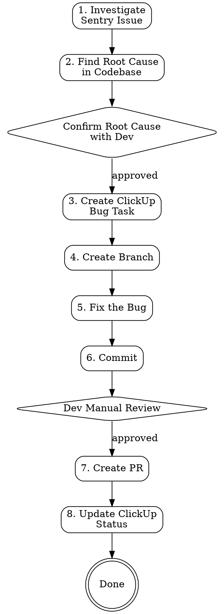

# Sentry Issue to Pull Request

## Overview

Complete bug fix lifecycle: Sentry error investigation → root cause analysis → ClickUp task creation → branch → code fix → commit → developer review → PR → task status update. Automates the full loop from production error to deliverable fix.

## Prerequisites

**Required MCP servers:**
- **Sentry** — for issue details and stacktrace analysis
- **ClickUp** — for task creation and status management

**Required CLI tools:**
- `gh` (GitHub CLI) — authenticated for PR creation
- `git` — with remotes configured

## Workflow



## Steps

### 1. Investigate Sentry Issue

```
Input: Sentry issue ID (numeric) or issue slug (e.g. PROJECT-ABC)
```

- Find organization: `mcp__sentry__find_organizations` → get `organizationSlug` and `regionUrl`
- Get issue details: `mcp__sentry__get_issue_details` with `issueId`, `organizationSlug`, `regionUrl`
- Extract and summarize:
  - **Error message** and type
  - **Culprit** function/file from stacktrace
  - **URL** where error occurs (identifies the module/page)
  - **Occurrences** and **users impacted**
  - **Most relevant stacktrace frame** (first-party code, not third-party/polyfills)

### 2. Find Root Cause in Codebase

Invoke the `superpowers:systematic-debugging` skill to guide the investigation:

- Identify the relevant module/component from the error context (URL, file path, class name)
- Search for the culprit function using `Grep` across the relevant module
- Read the affected files completely — understand the full context
- Trace the error through the call chain:
  - Where is this function/method called from?
  - What inputs could cause the failure? (null, undefined, empty, wrong type, race condition)
  - What assumptions does the code make that could be violated?
  - Is it a data flow issue, timing issue, missing guard, or incorrect logic?
- Document the root cause clearly

**⏸ STOP — Confirm with developer before proceeding.**

Present the root cause analysis to the developer and ask for confirmation using `AskUserQuestion`:
- Summarize the error, the identified root cause, and the proposed fix approach
- Do NOT proceed to step 3 until the developer confirms the analysis is correct

### 3. Create ClickUp Bug Task

**Ask the developer** which workspace, space, and sprint/folder to use — do NOT assume the latest sprint.

Use `AskUserQuestion` to confirm:
- **Workspace** — list available workspaces via `mcp__clickup__get_workspaces` and let the developer choose
- **Space** — list spaces via `mcp__clickup__get_spaces` and let the developer choose
- **Folder/Sprint** — list folders and lists, let the developer pick the target list

**Create the task:**
- `mcp__clickup__create_task` with:
  - **name**: `[Feature] [Screen] <Bug description>` (e.g. `[Aged Care GP] [Referral Form] Fix null reference on submit`)
  - **description**: Include Sentry issue link, error message, root cause, affected page, fix summary
  - **priority**: `2` (high)
  - **tags**: `["bug", "sentry"]`
  - **list_id**: the list ID confirmed by the developer

Save the **ClickUp Custom ID** (the custom task ID, e.g. `PROJ-123`) and **task title** — these are used for branch naming and PR title.

### 4. Create Branch

```bash
git checkout master && git pull
git checkout -b bugfix/<CustomID>-<short-kebab-description>
```

### 5. Fix the Bug

Invoke the `superpowers:test-driven-development` skill to guide the fix:
- Write a failing test that reproduces the bug (if testable)
- Make the **minimal, targeted fix** — don't refactor surrounding code
- Verify the fix addresses the exact root cause identified in step 2
- Run tests to confirm the fix passes
- Read the file after editing to confirm correctness

### 6. Commit

**Commit message format:**
```
[b] [<CustomID>] <Short description of the fix>

<Root cause explanation in 1-2 sentences>

Fixes <SENTRY-ISSUE-ID>
```

Stage changed files and commit.

### 7. Present to Developer & Create PR

**⏸ STOP — Present the fix for developer review before creating PR.**

Use `AskUserQuestion` to present:
- Summary of changes made (files changed, what was fixed)
- The commit diff
- Ask the developer to review and confirm whether to create the PR

If the developer requests changes, go back to step 5 and amend. Only proceed when approved.

**PR title format:** `[b] [<CustomID>] <ClickUp Task Title>`

**PR body format:**
```markdown
## Summary
- <What was fixed and why>
- <What was changed>

## Root Cause
<Detailed explanation of why the error occurred>

## Files Changed
- <list of files>

## Test plan
- [ ] <Steps to verify the fix>

**Sentry Issue:** <sentry-url>
**ClickUp Task:** <clickup-url>
```

**Steps:**
1. Push to remote with `-u` flag
2. Create PR with `gh pr create` targeting `master`
3. If fork setup causes issues, try pushing to `upstream` remote and use `GH_REPO` env var

### 8. Update ClickUp Task Status

After the PR is created successfully:
- Update the ClickUp task status to **PR - IN REVIEW** using `mcp__clickup__update_task`
- Add a comment on the task with the PR link using `mcp__clickup__create_task_comment`

## Common Mistakes

| Mistake | Fix |
|---------|-----|
| Fixing symptoms, not root cause | Always trace the full call chain before coding |
| Searching minified/compiled output instead of source | Identify the module from error context, then search source files (`.ts`, `.js`, `.py`, etc.) |
| Wrong ClickUp sprint/folder | Always ask the developer — never assume |
| Skipping dev confirmation | Always pause after root cause analysis — the developer must agree before fixing |
| Creating PR without dev review | Always present the fix and get approval before creating the PR |
| PR fails due to fork permissions | Push branch to the upstream remote directly, or use `--head owner:branch` |
| Overly broad fix | Fix only what the Sentry error reports — no refactoring |

## Checklist

- [ ] Sentry issue analyzed — error, stacktrace, URL, impact documented
- [ ] Root cause identified using systematic-debugging skill
- [ ] **Developer confirmed** root cause analysis before proceeding
- [ ] ClickUp task created in **developer-chosen** sprint/folder with Sentry link
- [ ] Task name follows `[Feature] [Screen] Bug description` format
- [ ] Branch created: `bugfix/<CustomID>-<desc>`
- [ ] Fix is minimal and targeted (using TDD skill)
- [ ] Changes committed with correct message format
- [ ] **Developer reviewed** the fix and approved PR creation
- [ ] PR title follows `[b] [CustomID] ClickUp Title` format
- [ ] PR includes summary, root cause, test plan, and links to Sentry + ClickUp
- [ ] ClickUp task status updated to **PR - IN REVIEW**
