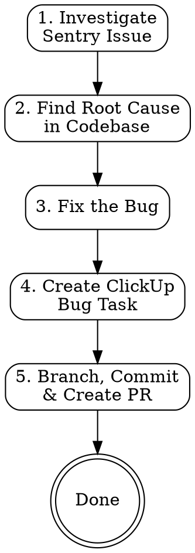

# Sentry Issue to Pull Request

## Overview

Complete bug fix lifecycle: Sentry error investigation → root cause analysis → code fix → ClickUp task creation → branch & PR. Automates the full loop from production error to deliverable fix.

## Prerequisites

**Required MCP servers:**
- **Sentry** — for issue details and stacktrace analysis
- **ClickUp** — for task creation in sprint boards

**Required CLI tools:**
- `gh` (GitHub CLI) — authenticated for PR creation
- `git` — with remotes configured

## Workflow



## Steps

### 1. Investigate Sentry Issue

```
Input: Sentry issue ID (numeric) or issue slug (e.g. PROJECT-ABC)
```

- Find organization: `mcp__sentry__find_organizations` → get `organizationSlug` and `regionUrl`
- Get issue details: `mcp__sentry__get_issue_details` with `issueId`, `organizationSlug`, `regionUrl`
- Extract and summarize:
  - **Error message** and type
  - **Culprit** function/file from stacktrace
  - **URL** where error occurs (identifies the module/page)
  - **Occurrences** and **users impacted**
  - **Most relevant stacktrace frame** (first-party code, not third-party/polyfills)

### 2. Find Root Cause in Codebase

- Identify the module from the error URL (e.g. `/aged-care-gp/` → aged-care-gp module)
- Search for the culprit function using `Grep` across the relevant module
- Read the affected files completely — understand the full context
- Trace the error through the call chain:
  - Who calls this function?
  - What values could be `undefined`/`null`?
  - What service/observable is expected vs what's actually returned?
- Document the root cause clearly before fixing

### 3. Fix the Bug

- Make the **minimal, targeted fix** — don't refactor surrounding code
- Verify the fix addresses the exact root cause identified in step 2
- Read the file after editing to confirm correctness

### 4. Create ClickUp Bug Task

**Find the latest sprint:**
- `mcp__clickup__get_workspaces` → workspace ID
- `mcp__clickup__get_spaces` → find the project's space ID
- Get sprint folder: use ClickUp API `GET /api/v2/space/{space_id}/folder` to list folders, find the Sprint Folder
- `mcp__clickup__get_lists` with `container_type: "folder"` → find latest sprint list by name

**Create the task:**
- `mcp__clickup__create_task` with:
  - **name**: `[b] <concise fix description>`
  - **description**: Include Sentry issue link, error message, root cause, affected page, fix summary, files changed
  - **priority**: `2` (high)
  - **tags**: `["bug", "sentry"]`
  - **list_id**: latest sprint list ID

### 5. Create Branch & PR

**Branch naming:** `fix/<SENTRY-ISSUE-ID>-<short-kebab-description>`

**Commit message format:**
```
[b] <Short description of the fix>

<Root cause explanation in 1-2 sentences>

Fixes <SENTRY-ISSUE-ID>

Co-Authored-By: Claude Opus 4.6 <noreply@anthropic.com>
```

**PR body format:**
```markdown
## Summary
- <What was fixed and why>
- <What was changed>

## Root Cause
<Detailed explanation of why the error occurred>

## Files Changed
- <list of files>

## Test plan
- [ ] <Steps to verify the fix>

**Sentry Issue:** <sentry-url>
**ClickUp Task:** <clickup-url>
```

**Steps:**
1. `git checkout master && git pull`
2. `git checkout -b fix/<SENTRY-ISSUE-ID>-<description>`
3. Stage changed files, commit
4. Push to remote with `-u` flag
5. Create PR with `gh pr create` targeting `master`
6. If fork setup causes issues, try pushing to `upstream` remote and use `GH_REPO` env var

## Common Mistakes

| Mistake | Fix |
|---------|-----|
| Fixing symptoms, not root cause | Always trace the full call chain before coding |
| Searching minified JS instead of source | Use the error URL to identify the Angular module, then search `.ts` source files |
| Wrong ClickUp sprint | Verify sprint dates cover the current date |
| PR fails due to fork permissions | Push branch to the upstream remote directly, or use `--head owner:branch` |
| Overly broad fix | Fix only what the Sentry error reports — no refactoring |

## Checklist

- [ ] Sentry issue analyzed — error, stacktrace, URL, impact documented
- [ ] Root cause identified and documented before coding
- [ ] Fix is minimal and targeted
- [ ] ClickUp task created in latest sprint with Sentry link
- [ ] Branch follows naming convention `fix/<SENTRY-ID>-<desc>`
- [ ] Commit message includes `Fixes <SENTRY-ID>`
- [ ] PR includes summary, root cause, test plan, and links to Sentry + ClickUp
